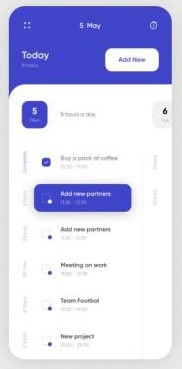

# **Todo App | Team1**
   

##   ✧ Description of our App
   - Todo App is a simple and awesome app to organize your tasks with a very easy to use interface. Todo can help you to make a list of your tasks and track them.

##  ✧ User Stories
   - _As a user_, I should be able to add my to-do to the list and save it in local storage
   - _As a user_, I should be able to edit my to-dos
   - _As a user_, I should be able to remove any to-do from my list (remove it from local storage)
   - _As a user_, I can still have my list even if I close the browser window

## ✧ Technology we used:
   - HTML → to build the structure of the pages     
   - CSS →  to style the application
   - JS|DOM Manipulations → To create interaction between the page and the user
   - localStorage → to store the data

## ✧ installing the project locally:
   - git clone https://github.com/GSG-FC03/Todolist-Team1.git
   - cd Todolist-Team1
   - code .
   

## ✧ link
**[Git hub](https://github.com/GSG-FC03/Todolist-Team1).**

**[live link](https://gsg-fc03.github.io/Todolist-Team1/)
.**

##  ✧ Main Page Design

  ## ✧ Team Leader
* [Sara J](https://github.com/sara219).

## ✧ Team Members 
1. [Mutasem Mansour](https://github.com/MMansour87).
2. [Doaa Abdulslam](https://github.com/Doaa-Abdulsalam).
3. [Fatma Abu El-Fateh](https://github.com/FatmaHossam5).
4. [Mohammed Hasan](https://github.com/MohammedHasan-99).
